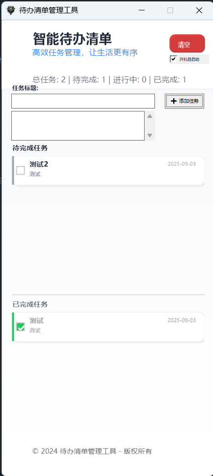

# 智能待办清单管理工具

一款功能强大、界面美观的Windows桌面待办清单应用程序，专为高效任务管理而设计。

## ✨ 主要功能

### 📋 任务管理
- **创建任务**：支持任务标题和详细描述
- **状态跟踪**：待完成、进行中、已完成、已取消四种状态
- **优先级设置**：低、普通、高、紧急四个优先级
- **时间记录**：自动记录创建时间和完成时间
- **任务编辑**：双击任务卡片即可编辑内容

### 🎨 现代化界面
- **优雅设计**：现代化Material Design风格界面
- **任务卡片**：美观的卡片式任务展示
- **颜色标识**：不同状态和优先级的颜色区分
- **响应式布局**：适应不同窗口大小
- **平滑动画**：流畅的界面过渡效果

### 🖥️ 智能窗口管理
- **磁性吸附**：窗口接近屏幕边缘自动吸附（30像素检测范围）
- **自动隐藏**：吸附后鼠标离开1秒自动隐藏到屏幕外
- **智能显示**：隐藏时留出10像素便于找回
- **边界约束**：防止窗口完全拖出屏幕
- **位置记忆**：记住正常使用位置，重启后恢复
- **状态恢复**：保存吸附状态，重启后自动恢复

### ⚙️ 系统集成
- **开机自启动**：可选的开机自动启动功能
- **启动文件夹**：通过Windows启动文件夹实现（无需管理员权限）
- **配置持久化**：自动保存所有设置和任务数据
- **Unicode支持**：完整支持中文等多语言字符

### 📁 数据管理
- **JSON存储**：使用JSON格式存储任务数据
- **UTF-8编码**：完整支持特殊字符和换行符
- **自动备份**：实时保存，防止数据丢失
- **格式兼容**：标准JSON格式，易于导入导出

## 🚀 技术特点

### 开发语言和框架
- **C++**：高性能的原生Windows应用
- **Win32 API**：直接调用系统API，响应迅速
- **GDI+**：现代图形绘制，支持抗锯齿和高质量渲染
- **Unicode**：完整的Unicode支持

### 性能优化
- **双缓冲绘制**：消除界面闪烁
- **高DPI感知**：适应高分辨率显示器
- **内存管理**：智能内存使用，低资源占用
- **静态编译**：单exe文件，无依赖运行

### 用户体验
- **零学习成本**：直观的操作方式
- **键盘友好**：支持键盘快速操作
- **鼠标优化**：精确的点击区域和光标变化
- **视觉反馈**：丰富的状态提示和动画效果

## 📦 安装使用

### 系统要求
- Windows 10/11 (推荐)
- Windows 7/8/8.1 (兼容)
- 至少50MB磁盘空间
- 支持Unicode的中文环境

### 快速开始
1. 下载 `TodoList.exe` 文件
2. 双击运行（首次运行可能需要允许防火墙）
3. 开始添加您的待办事项
4. 在设置中可启用开机自启动

### 编译说明
如需从源码编译，请参考 [编译说明.txt](编译说明.txt) 文件。

## 🎯 使用技巧

### 任务管理
- 点击任务前的复选框可切换完成状态
- 双击任务卡片可编辑任务内容
- 支持换行的任务描述（显示限制2行）
- 清空按钮可一键清除所有任务

### 窗口操作
- 拖拽窗口到屏幕边缘实现自动吸附
- 吸附后鼠标离开窗口会自动隐藏
- 鼠标移动到屏幕边缘的10像素区域可唤醒窗口
- 窗口支持自由调整大小（无最大化按钮）

### 数据安全
- 任务数据自动保存到 `todo_list_config.json`
- 窗口设置保存到 `window_config.json`
- 建议定期备份配置文件

## 📋 更新日志

### v1.0.0
- ✅ 完整的任务管理功能
- ✅ 现代化界面设计
- ✅ 智能窗口吸附和隐藏
- ✅ 开机自启动设置
- ✅ 完整的Unicode和特殊字符支持
- ✅ 任务描述2行显示限制
- ✅ JSON转义确保数据完整性

## 🤝 贡献

欢迎提交Issue和Pull Request来改进这个项目！

### 开发环境
- MinGW-w64 或 Visual Studio
- Windows SDK
- GDI+ 支持

## 📄 许可证

本项目基于 [Apache-2.0 License](LICENSE) 开源协议发布。

## 👨‍💻 作者

**haotianai** - [GitHub](https://github.com/haotianai)

---

⭐ 如果这个项目对您有帮助，请给它一个星标！

📧 有问题或建议？欢迎提交Issue或联系作者。
